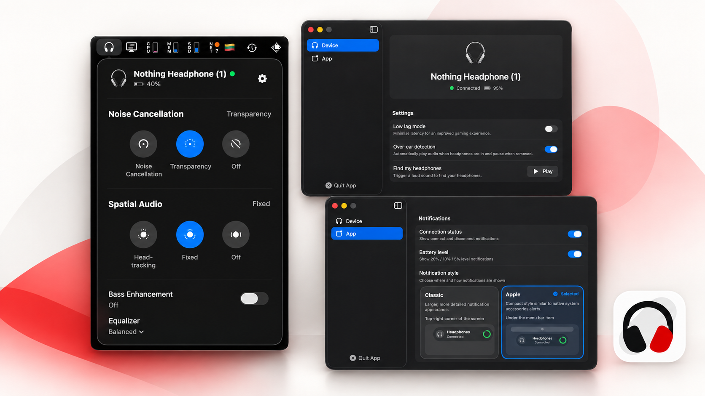

<p align="center">
  
</p>

<h1 align="center">NothingBar</h1>

<p align="center"><strong>Your Nothing headphones live in the menu bar.</strong></p>

<p align="center">
  <a href="https://nothingbar.bestk1ng.com/">Website</a> ·
  <a href="https://github.com/bestK1ngArthur/nothing-bar/releases">Download</a> ·
  <a href="https://github.com/bestK1ngArthur/nothing-bar/issues/new/choose">Report an issue</a>
</p>

<p align="center">
  
</p>

> It's unofficial software and not affiliated with Nothing ([legal](#legal-disclaimer)).

Native macOS menu bar app to control Nothing and CMF headphones. Completely local, fully native, no analytics, entirely free. Feel free to contribute.

Special credits to the [Ear (web)](https://earweb.bttl.xyz/) developers for the Bluetooth communication code — it has been really helpful in developing this project.

## Features

- Check battery levels and control noise cancellation, transparency, Spatial Audio, bass, and EQ from the menu bar. Available controls depend on your device.
- Play a sound to find supported earbuds.
- Get connection and low-battery notifications in Classic or Apple style.
- Choose a language, launch at login, and get automatic updates through [Sparkle](https://sparkle-project.org/).
- Keep everything local: no account, cloud, or analytics.

## Installation

### Homebrew

```shell
brew tap bestk1ngarthur/nothingbar https://github.com/bestK1ngArthur/nothing-bar
brew install --cask bestk1ngarthur/nothingbar/nothingbar
```

### Manually

Download the `.zip` archive from [releases](https://github.com/bestK1ngArthur/nothing-bar/releases) and drag `NothingBar.app` to the `/Applications` folder.

The app updates automatically through [Sparkle](https://sparkle-project.org/); you can manage this in the app settings.

## Screenshots

<p align="center">
  
</p>

| Device settings | Notification settings |
| --- | --- |
|  |  |

| Classic notification | Apple notification |
| --- | --- |
|  |  |

## Languages

NothingBar follows your Mac's language by default. You can also choose **English**, **Español**, or **Català** in **Settings → App → App language**. Restart the app when prompted to apply the change.

### Add a language

Translations are welcome! If you'd like to add one:

1. Add the language to the project in Xcode under **Project → Info → Localizations**.
2. Translate the English entries in [`Localizable.xcstrings`](NothingBar/Localizable.xcstrings) and [`InfoPlist.xcstrings`](NothingBar/InfoPlist.xcstrings). Keep placeholders and format values intact.
3. Add its language code and native display name to `AppLanguage` in [`AppData.swift`](NothingBar/Models/AppData.swift), so it appears in the app language picker.
4. Build the app, switch to the new language in Settings, restart, and check the menu bar, settings, notifications, and permission prompts.
5. [Open a pull request](https://github.com/bestK1ngArthur/nothing-bar/compare) with your translation. I'll review it when I can.

## Supported Devices

- 🟢 _works and tested_
- 🟡 _may work, but support is still in process_

> The library [swift-nothing-ear](https://github.com/bestK1ngArthur/swift-nothing-ear) is used to communicate with the device. New features should first be supported there, and then in the app.

- 🟡 Nothing Ear (1)
- 🟡 Nothing Ear (2)
- 🟡 Nothing Ear (3)
- 🟡 Nothing Ear (3a)
- 🟡 Nothing Ear (stick)
- 🟡 Nothing Ear (open)
- 🟡 Nothing Ear
- 🟢 Nothing Ear (a)
- 🟢 Nothing Headphone (1)
- 🟡 Nothing Headphone (a)
- 🟡 CMF Buds Pro
- 🟢 CMF Buds Pro 2
- 🟡 CMF Buds
- 🟡 CMF Buds Neo
- 🟡 CMF Buds 2a
- 🟢 CMF Buds 2
- 🟡 CMF Buds 2 Plus
- 🟡 CMF Neckband Pro
- 🟡 CMF Headphone Pro
- 🟡 CMF Clip Pro

> [!TIP]
> If nothing happens when connecting the headphones, please check the **Bluetooth device name**. It's better if it matches the factory name (or a suitable model from the list above). Some models can be automatically detected by serial number, but not all.

## How to Contribute

1. Fork the repository.
2. Implement a new feature, fix a bug, or make any changes you'd like. You can use AI agents or any tools you prefer to help with coding, but please review and test your code manually before submitting.
3. Create a pull request describing what you've done and why it should be merged into the app. I'll review the changes, which may take some time. I may also ask you to make some modifications. In rare cases, I might decline the pull request with an explanation.
4. After merging, once enough changes have accumulated for a release, I'll build an update and make it available to all users.
5. Thank you for your contribution — you're awesome!

> [!NOTE]
> If you want to modify the headphone interaction functionality, you should make those changes in the [swift-nothing-ear](https://github.com/bestK1ngArthur/swift-nothing-ear) package.

If you can't code but have ideas on how to improve the app, please [create an issue](https://github.com/bestK1ngArthur/nothing-bar/issues/new/choose) and describe your idea, bug report, or any other needed change. I'll do my best to implement the necessary functionality in my spare time.

## Future Features

- [x] Auto-update system
- [x] Spatial Audio
- [x] Installation from Homebrew
- [x] Find buds
- [ ] More EQ capabilities
- [ ] Handle controls gestures

## Legal Disclaimer

1. This software is not affiliated with, sponsored by, or endorsed by Nothing Technology. This software is a third-party project and is NOT an official Nothing product.

2. Nothing, the Nothing logo and other brand related content are trademarks of Nothing Technology Limited and are protected by copyright, trademark, and other intellectual property laws.

3. You use this software at your own risk. The developer makes no warranties regarding compatibility with all firmware versions, performance, or reliability. 

4. The developer shall not be liable for any direct or indirect damages arising from the use of the software, including data loss, hardware damage, or degraded audio quality. 

5. By installing and using this software, you agree to the terms of this disclaimer.

If you have questions, [contact me](mailto:bestk1ngarthur@aol.com).
